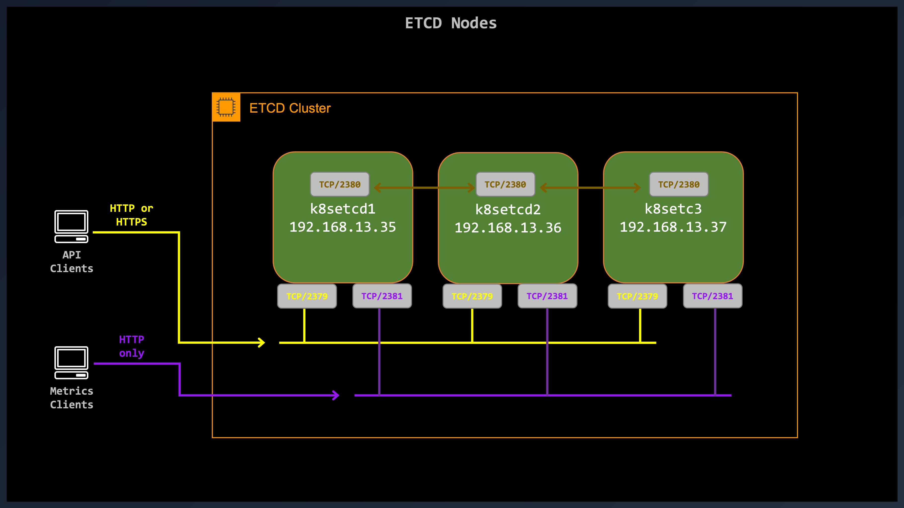
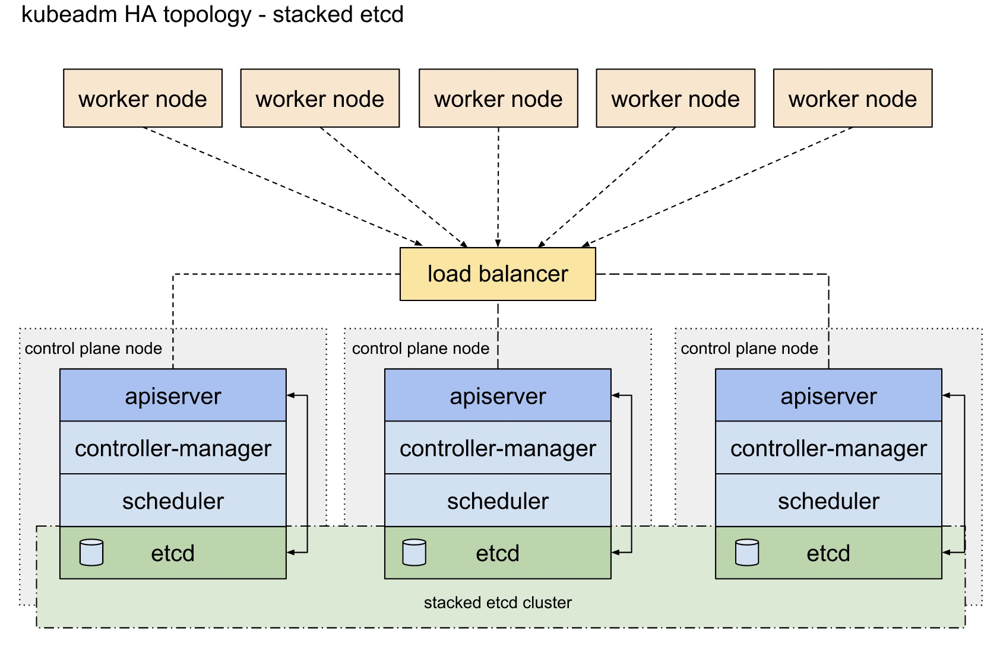
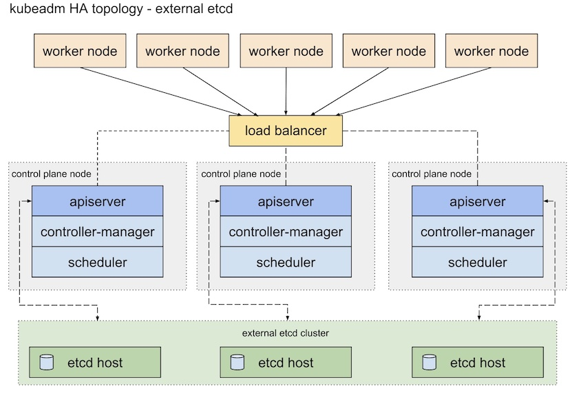

# Set up a High Availability etcd Cluster
`etcd` is distributed, reliable key-value store for the most critical data of a distributed system. It's a strongly consistent, distributed key-value store that provides a reliable way to store data that needs to be accessed by a distributed system or cluster of machines. It gracefully handles leader elections during network partitions and can tolerate machine failure, even in the leader node.

This guide will cover the instructions for bootstrapping an `etcd` cluster on a three-node cluster from pre-built binaries. This tutorial has nothing to do with Kubernetes but it could eventually be used when installing an H.A Kubernetes Cluster with `External etcd` topology.

# Before you begin
We will be using three Ubuntu Server 22.04.3 with Linux Kernel 6.6.1-zabbly+.

Prerequisites:
- The three nodes that can communicate with each other on TCP port `2380`.
- The clients of the `etcd` cluster can reach any of them on TCP port `2379`.
  - TCP port `2379` is the traffic for client requests
  - TCP port `2380` is the traffic for server-to-server communication
  - TCP port `2381` is the traffic for the endpoints `/metrics` and `/health` (Optional)
- Each host must have `systemd` and a `bash` compatible shell installed.
- Some infrastructure to copy files between hosts. For example, `scp` can satisfy this requirement.

# Setup an External ETCD Cluster
In this tutorial we will configure a three-node TLS enabled `etcd` cluster that can act as an external datastore, like a Kubernetes H.A. Cluster 😉

|Role|FQDN|IP|OS|Kernel|RAM|vCPU|
|----|----|----|----|----|----|----|
|etcd database|k8s1etcd1.kloud.lan|10.103.1.101|Ubuntu 22.04.3|6.6.1|2G|2|
|etcd database|k8s1etcd2.kloud.lan|10.103.1.102|Ubuntu 22.04.3|6.6.1|2G|2|
|etcd database|k8s1etcd3.kloud.lan|10.103.1.103|Ubuntu 22.04.3|6.6.1|2G|2|
|etcd database|k8s1etcd4.kloud.lan|10.103.1.201|Ubuntu 22.04.3|6.6.1|2G|2|
|etcd database|k8s1etcd5.kloud.lan|10.103.1.202|Ubuntu 22.04.3|6.6.1|2G|2|
|etcd database|k8s1etcd6.kloud.lan|10.103.1.203|Ubuntu 22.04.3|6.6.1|2G|2|



# Download the binaries
Install the latest version of the binaries on each of the Linux host.

> [!NOTE]  
> `etcdctl` is a command line tool for interacting with the `etcd` database(s) in a cluster.

## Install `ETCD` from binaries
```sh
VER=$(curl -s https://api.github.com/repos/etcd-io/etcd/releases/latest|grep tag_name | cut -d '"' -f 4)
echo ${VER}
curl -LO https://github.com/etcd-io/etcd/releases/download/${VER}/etcd-${VER}-linux-amd64.tar.gz
tar xvf etcd-${VER}-linux-amd64.tar.gz
cd etcd-${VER}-linux-amd64
sudo install etcd etcdctl etcdutl -m 755 -o root -g adm /usr/local/bin/
```

## Verify installation
Check the binaries you just installed:
```sh 
etcd --version
etcdctl version
etcdutl version
```

## Cleanup
Remove the temporary directory and files created in the above step:
```sh
cd ..
rm -rf etcd-${VER}-linux-amd64
rm etcd-${VER}-linux-amd64.tar.gz
unset VER
```

# Generating and Distributing TLS Certificates
We will use the `openssl` tool to generate our own CA and all the `etcd` server certificates and keys. You can use your own certificate manager.

## Define Variables
Define all the variables needed for the scripts below. Make sure you execute the scripts in the same window as the one you defined the variables.
```sh
declare -A newVM
newVM[k8s1etcd1]="10.103.1.101"
newVM[k8s1etcd2]="10.103.1.102"
newVM[k8s1etcd3]="10.103.1.103"
newVM[k8s1etcd4]="10.103.1.201"
newVM[k8s1etcd5]="10.103.1.202"
newVM[k8s1etcd6]="10.103.1.203"

#
CA_CERT="etcd-ca"
```

## Generate Private CA
This script will generate a CA root certificate with its private key. The argument is the prefix of both files created:
```sh
./11-ecc_CA.sh etcd-ca
```

This results in two files:
- `etcd-ca.crt` is the CA certificate
- `etcd-ca.key` is the CA private key

## Generate Node Certificates
You could use the same client certificate of every `etcd` node and it will work fine. I've decided to use different certificate for each node. This following will generate the certificate and key for every `etcd` node in the cluster. Delete the `csr` files as they are not needed anymore:
```sh
for NEW in "${!newVM[@]}"
do
  # ./12-gen_cert.sh <host> <ip addr> <CA CERT>
  ./12-gen_cert.sh "${NEW}" "${newVM[${NEW}]}" "${CA_CERT}"
done

# Generate the certificate for the master node
./12-gen_cert.sh k8s1master1 10.101.1.101 etcd-ca ',DNS:k8s1master2,DNS:k8s1master3,DNS:k8s1master4,DNS:k8s1master5,DNS:k8s1master6,DNS:k8s1master2.kloud.lan,DNS:k8s1master3.kloud.lan,DNS:k8s1master4.kloud.lan,DNS:k8s1master5.kloud.lan,DNS:k8s1master6.kloud.lan,IP:10.101.1.102,IP:10.101.1.103,IP:10.101.1.201,IP:10.101.1.202,IP:10.101.1.203'
rm -f *.csr
```

I copied the master node certificate and key to `apiserver-etcd-client.{crt,key}` since they will be client certificates on each of the K8s Master node to authenticate on any `etcd` server.
```sh
cp k8s1master1.crt apiserver-etcd-client.crt
cp k8s1master1.key apiserver-etcd-client.key
```

> [!IMPORTANT]  
> Keep those files as they will be required on all K8s master nodes.

The last command is for our Kubernetes Control Plane nodes:

This results in two files per `etcd` node. The `.crt` is the certificate and the `.key` is the private key:
- k8s1etcd1.crt
- k8s1etcd1.key
- k8s1etcd2.crt
- k8s1etcd2.key
- k8s1etcd3.crt
- k8s1etcd3.key
- k8s1etcd4.crt
- k8s1etcd4.key
- k8s1etcd5.crt
- k8s1etcd5.key
- k8s1etcd6.crt
- k8s1etcd6.key
- k8smaster1.crt
- k8smaster1.key
- apiserver-etcd-client.crt
- apiserver-etcd-client.key

> [!IMPORTANT]  
> The private keys are not encrypted as `etcd` needs a non-encrypted `pem` file.

At this point, we have the certificates and keys generated for the CA and all the six `etcd` nodes. The nodes certifcate has a SAN with the hostname, FQDN and IP address. See example below for node `k8s1etcd1`
- DNS:k8s1etcd1
- DNS:k8s1etcd1.kloud.lan
- IP Address:10.103.1.101

# Distribute Certificates
We need to to distribute these certificates and keys to each `etcd` node in the cluster. I've made a script. Adusts the nodes and execute.
```sh
./13-scp.sh
```

# Move Certificate and Key
SSH into each `etcd` node and run the below commands to move the certificate and key into the `/etc/etcd/pki` directory. I will be using `tmux` to run the commands on every node at the same time. Just paste the following in each node. The certificates and keys have the prefix of the short hostname. The variable `ETCD_NAME` will be different on each node.
```sh
ETCD_NAME=$(hostname -s)
echo ${ETCD_NAME}
sudo mkdir -p /etc/etcd/pki
sudo mv etcd-ca.crt /etc/etcd/pki/.
sudo mv ${ETCD_NAME}.{crt,key} /etc/etcd/pki/.
sudo chmod 600 /etc/etcd/pki/${ETCD_NAME}.key
```

We have generated and copied all the certificates/keys on each node. In the next step, we will create the configuration file and the `systemd` unit file for each node.

# Create `etcd` configuration file
This is the configuration file `/etc/etcd/etcd.conf` that needs to be copied on each node. The command can be pasted simultaneously on all the nodes. I will be using `tmux` again:
```sh
ETCD_CLUSTER_NAME=etcd-cluster-1
ETCD_IP=$(hostname -I | sed 's/^[[:space:]]*//;s/[[:space:]]*$//')
ETCD_NAME=$(hostname -s)
ETCD1_IP=10.103.1.101
ETCD2_IP=10.103.1.102
ETCD3_IP=10.103.1.103
ETCD4_IP=10.103.1.201
ETCD5_IP=10.103.1.202
ETCD6_IP=10.103.1.203

cat <<EOF | sudo tee /etc/etcd/etcd.conf > /dev/null
# Human-readable name for this member.
name: "${ETCD_NAME}"

# List of comma separated URLs to listen on for peer traffic.
listen-peer-urls: "https://${ETCD_IP}:2380"

# List of comma separated URLs to listen on for client traffic.
listen-client-urls: "https://${ETCD_IP}:2379,https://127.0.0.1:2379"

# List of additional URLs to listen on, will respond to /metrics and /health endpoints
listen-metrics-urls: "http://${ETCD_IP}:2381,http://127.0.0.1:2381"

# Initial cluster token for the etcd cluster during bootstrap.
initial-cluster-token: o3ZBeUqBgjAMArh8c5BQmuK

# Comma separated string of initial cluster configuration for bootstrapping.
initial-cluster: "k8s1etcd1=https://${ETCD1_IP}:2380,k8s1etcd2=https://${ETCD2_IP}:2380,k8s1etcd3=https://${ETCD3_IP}:2380,k8s1etcd4=https://${ETCD4_IP}:2380,k8s1etcd5=https://${ETCD5_IP}:2380,k8s1etcd6=https://${ETCD6_IP}:2380"

# List of this member's peer URLs to advertise to the rest of the cluster.
# The URLs needed to be a comma-separated list.
initial-advertise-peer-urls: "https://${ETCD_IP}:2380"

# List of this member's client URLs to advertise to the public.
# The URLs needed to be a comma-separated list.
advertise-client-urls: "https://${ETCD_IP}:2379,https://127.0.0.1:2379"

client-transport-security:
  # Path to the client server TLS cert file.
  cert-file: "/etc/etcd/pki/${ETCD_NAME}.crt"

  # Path to the client server TLS key file.
  key-file: "/etc/etcd/pki/${ETCD_NAME}.key"

  # Path to the client server TLS trusted CA cert file.
  trusted-ca-file: "/etc/etcd/pki/etcd-ca.crt"

  # Enable client cert authentication.
  client-cert-auth: true

peer-transport-security:
  # Path to the peer server TLS cert file.
  cert-file: "/etc/etcd/pki/${ETCD_NAME}.crt"

  # Path to the peer server TLS key file.
  key-file: "/etc/etcd/pki/${ETCD_NAME}.key"

  # Enable peer client cert authentication.
  client-cert-auth: true

  # Path to the peer server TLS trusted CA cert file.
  trusted-ca-file: "/etc/etcd/pki/etcd-ca.crt"

# Path to the data directory.
data-dir: "/var/lib/etcd"

# Initial cluster state ('new' or 'existing').
initial-cluster-state: 'new'
EOF
```

> [!IMPORTANT]  
> Any locations specified by `listen-metrics-urls` will respond to the `/metrics` and `/health` endpoints in `http` only.
> This can be useful if the standard endpoint is configured with mutual (client) TLS authentication (`listen-client-urls: "https://...`), but a load balancer or monitoring service still needs access to the health check with `http` only.
> The endpoint `listen-client-urls` still answers to `https://.../metrics`.

# Configuring and Starting the `etcd` Cluster
On every node, create the file `/etc/systemd/system/etcd.service` with the following contents. I will be using `tmux` to execute the command once aon all the nodes:
```sh
cat <<EOF | sudo tee /lib/systemd/system/etcd.service
[Unit]
Description=etcd is a strongly consistent, distributed key-value store database
Documentation=https://github.com/etcd-io/etcd
After=network.target
 
[Service]
Type=notify
ExecStart=/usr/local/bin/etcd --config-file /etc/etcd/etcd.conf
Restart=always
RestartSec=5s
LimitNOFILE=40000
 
[Install]
WantedBy=multi-user.target
EOF
```

# Start `etcd` service
Start the `etcd` service on all VMs:
```sh
sudo systemctl daemon-reload
sudo systemctl enable --now etcd
sudo systemctl status etcd
```

# Testing and Validating the Cluster
To interact with the cluster we will be using `etcdctl`. It's the utility to interact with the `etcd` cluster. This utility as been installed in `/usr/local/bin` on three nodes and I also installed it on a bastion host.

> [!NOTE]  
> Unless otherwise specified, all the `etcdctl` commands are run from a bastion host. I try not to be on any `etcd` node if possible.

You can export these environment variables and connect to the clutser without specifying the values each time:
```sh
ETCD_NAME=$(hostname -s)
export ETCDCTL_ENDPOINTS=https://k8s1etcd1.kloud.lan:2379,https://k8s1etcd2.kloud.lan:2379,https://k8s1etcd3.kloud.lan:2379,https://k8s1etcd4.kloud.lan:2379,https://k8s1etcd5.kloud.lan:2379,https://k8s1etcd6.kloud.lan:2379
export ETCDCTL_CACERT=/etc/etcd/pki/etcd-ca.crt
export ETCDCTL_CERT=/etc/etcd/pki/${ETCD_NAME}.crt
export ETCDCTL_KEY=/etc/etcd/pki/${ETCD_NAME}.key
```

> [!NOTE]  
> `export ETCDCTL_API=3` is not needed anymore with version 3.4.x  
> You can use any of the three client certificate/key with `ETCDCTL_CERT` and `ETCDCTL_KEY` because they are all signed by the same CA.  
> You can generate another certificate/key pair for your bastion host, as long as the certificate is signed by the `etcd-ca`.  

## Check Cluster status
To execute the next command, you can be on any host that:
- can reach the `etcd` servers on port `TCP/2379`
- has the client certificate, the CA certificate and private key

And now its a lot easier
```sh
etcdctl --write-out=table member list
etcdctl --write-out=table endpoint status
etcdctl --write-out=table endpoint health
```

See below for the ouput of the three commands above:
```
etcdctl --write-out=table member list
+----------------------------------+--------+-------------+-------+
|             ENDPOINT             | HEALTH |    TOOK     | ERROR |
+----------------------------------+--------+-------------+-------+
| https://k8s1etcd6.kloud.lan:2379 |   true | 44.772878ms |       |
| https://k8s1etcd2.kloud.lan:2379 |   true | 44.961187ms |       |
| https://k8s1etcd3.kloud.lan:2379 |   true | 45.047559ms |       |
| https://k8s1etcd1.kloud.lan:2379 |   true | 45.184589ms |       |
| https://k8s1etcd4.kloud.lan:2379 |   true | 55.984617ms |       |
| https://k8s1etcd5.kloud.lan:2379 |   true | 56.282559ms |       |
+----------------------------------+--------+-------------+-------+
```

```
etcdctl --write-out=table endpoint status
+----------------------------------+------------------+---------+---------+-----------+------------+-----------+------------+--------------------+--------+
|             ENDPOINT             |        ID        | VERSION | DB SIZE | IS LEADER | IS LEARNER | RAFT TERM | RAFT INDEX | RAFT APPLIED INDEX | ERRORS |
+----------------------------------+------------------+---------+---------+-----------+------------+-----------+------------+--------------------+--------+
| https://k8s1etcd1.kloud.lan:2379 | 7719dc9215aa4c11 |  3.5.10 |   20 kB |     false |      false |         6 |         67 |                 67 |        |
| https://k8s1etcd2.kloud.lan:2379 | 2ea42db69810c8fe |  3.5.10 |   20 kB |     false |      false |         6 |         67 |                 67 |        |
| https://k8s1etcd3.kloud.lan:2379 | 465942f9fe912696 |  3.5.10 |   25 kB |     false |      false |         6 |         67 |                 67 |        |
| https://k8s1etcd4.kloud.lan:2379 | 7b7051746f0994f4 |  3.5.10 |   20 kB |     false |      false |         6 |         67 |                 67 |        |
| https://k8s1etcd5.kloud.lan:2379 | 7e1b8e4dc5233603 |  3.5.10 |   20 kB |     false |      false |         6 |         67 |                 67 |        |
| https://k8s1etcd6.kloud.lan:2379 | cebb28b5bccb39f9 |  3.5.10 |   20 kB |      true |      false |         6 |         67 |                 67 |        |
+----------------------------------+------------------+---------+---------+-----------+------------+-----------+------------+--------------------+--------+
```

```
etcdctl --write-out=table endpoint health
+------------------+---------+-----------+---------------------------+--------------------------------------------------+------------+
|        ID        | STATUS  |   NAME    |        PEER ADDRS         |                   CLIENT ADDRS                   | IS LEARNER |
+------------------+---------+-----------+---------------------------+--------------------------------------------------+------------+
| 2ea42db69810c8fe | started | k8s1etcd2 | https://10.103.1.102:2380 | https://10.103.1.102:2379,https://127.0.0.1:2379 |      false |
| 465942f9fe912696 | started | k8s1etcd3 | https://10.103.1.103:2380 | https://10.103.1.103:2379,https://127.0.0.1:2379 |      false |
| 7719dc9215aa4c11 | started | k8s1etcd1 | https://10.103.1.101:2380 | https://10.103.1.101:2379,https://127.0.0.1:2379 |      false |
| 7b7051746f0994f4 | started | k8s1etcd4 | https://10.103.1.201:2380 | https://10.103.1.201:2379,https://127.0.0.1:2379 |      false |
| 7e1b8e4dc5233603 | started | k8s1etcd5 | https://10.103.1.202:2380 | https://10.103.1.202:2379,https://127.0.0.1:2379 |      false |
| cebb28b5bccb39f9 | started | k8s1etcd6 | https://10.103.1.203:2380 | https://10.103.1.203:2379,https://127.0.0.1:2379 |      false |
+------------------+---------+-----------+---------------------------+--------------------------------------------------+------------+
```

>For the `--endpoints`, enter all of your nodes. I used the short hostname, FQDN and IP address.

## Check the logs
> [!NOTE]  
> You need to be on an `etcd` host to execute the following command:

Check for any warnings/errors on every nodes:
```sh
journalctl -xeu etcd.service
```

## Write and Read test
We'll write a KV pair and read it:
**STEP1:** Write a value on one node:
```sh
etcdctl put key1 "Hello World!"
```

**STEP2:** Read the data back:
```sh
etcdctl get key1
etcdctl --write-out="json" get key1 | jq
```

Another way of getting the `key` and `value` stored in the database:
```sh
etcdctl --write-out="json" get key1 | jq -r '.kvs[].key' | base64 -d -; echo ""
etcdctl --write-out="json" get key1 | jq -r '.kvs[].value' | base64 -d -; echo ""
```

The output should be the key and value:
```
key1
Hello World!
```

## Test with `cURL`
Not very usefull. Use `etcdctl` and `etcdutl`.
```sh
ENDPOINT1='https://10.103.1.102:2379'
curl -v --cacert ./etcd-ca.crt --cert ./k8s1etcd1.crt --key ./k8s1etcd1.key \
-L ${ENDPOINT1}/v3/kv/range -X POST -d '{"key":"L3B1Yi9hYWFh"}'
```

## Test Metrics
```sh
METRIC='http://10.103.1.102:2381'
curl -L ${METRIC}/metrics
```

Check the `/health` endpoint for all your nodes:
```sh
ETCD_NODES=( k8s1etcd1 k8s1etcd2 k8s1etcd3 k8s1etcd4 k8s1etcd5 k8s1etcd6 ); for NODE in "${ETCD_NODES[@]}"; do curl -L http://${NODE}:2381/health; echo ""; done
```

> [!IMPORTANT]  
> If you get a `Connection refused` on the node where the script is run, it used IP address `127.0.1.1` instead of `127.0.0.1`.
> Use the FQDN to test it.

```
127.0.0.1 localhost k8s1etcd1
127.0.1.1 k8s1etcd1
...
```

Output from `k8s1etcd1`. The first line failed because it tried address `127.0.1.1`. This is normal 😉:
```
curl: (7) Failed to connect to k8s1etcd1 port 2381 after 0 ms: Connection refused

{"health":"true","reason":""}
{"health":"true","reason":""}
{"health":"true","reason":""}
{"health":"true","reason":""}
{"health":"true","reason":""}
```

# Congratulation
You should have a three-node `etcd` cluster in **High Availibility** mode 🍾🎉🥳

# References
[etcd main website](https://etcd.io/)  
[Set up a High Availability etcd Cluster with kubeadm](https://kubernetes.io/docs/setup/production-environment/tools/kubeadm/setup-ha-etcd-with-kubeadm/)  
[Options for Highly Available Topology](https://kubernetes.io/docs/setup/production-environment/tools/kubeadm/ha-topology/)  
[Configuration file for etcd server](https://github.com/etcd-io/etcd/blob/main/etcd.conf.yml.sample)  

---

My goal is to incorporate this above tutorial with configuring an H.A. Kubernetes Cluster.

# Options for Highly Available Topology
You can set up an HA cluster:

- With stacked control plane nodes, where `etcd` nodes are colocated with control plane nodes
- With external `etcd` nodes, where `etcd` runs on separate nodes from the control plane

You should carefully consider the advantages and disadvantages of each topology before setting up an HA cluster.

## Stacked ETCD topology
A stacked HA cluster is a topology where the distributed data storage cluster provided by `etcd` is stacked on top of the cluster formed by the nodes managed by `kubeadm` that run control plane components.

Each control plane node runs an instance of the `kube-apiserver`, `kube-scheduler`, and `kube-controller-manager`. The `kube-apiserver` is exposed to worker nodes using a load balancer.

Each control plane node creates a local `etcd` member and this `etcd` member communicates only with the `kube-apiserver` of this node.

This topology couples the control planes and `etcd` members on the same nodes.

However, a stacked cluster runs the risk of failed coupling. If one node goes down, both an `etcd` member and a control plane instance are lost, and redundancy is compromised.

You should therefore run a minimum of three stacked control plane nodes for an HA cluster.



## External ETCD topology

An HA cluster with external `etcd` is a topology where the distributed data storage cluster provided by `etcd` is external to the cluster formed by the nodes that run control plane components.

Like the stacked `etcd` topology, each control plane node in an external `etcd` topology runs an instance of the `kube-apiserver`, `kube-scheduler`, and `kube-controller-manager`. And the `kube-apiserver` is exposed to worker nodes using a load balancer. However, `etcd` members run on *separate hosts*, and each `etcd` host communicates with the `kube-apiserver` of every control plane node.

This topology decouples the control plane and `etcd` member. It therefore provides an HA setup where losing a control plane instance or an `etcd` member has less impact and does not affect the cluster redundancy as much as the stacked HA topology.

However, this topology requires twice the number of hosts as the stacked HA topology. A minimum of three hosts for control plane nodes and three hosts for `etcd` nodes are required for an HA cluster with this topology.


