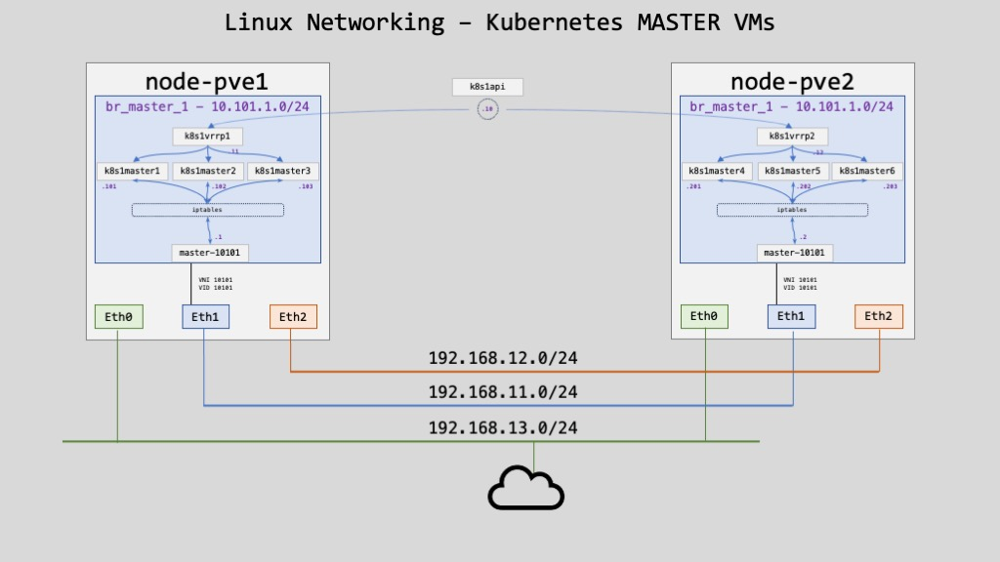

# Kubernetes High Availability(HA)
Kubernetes High Availability (HA) cluster uses multiple master nodes, each of which has access to same worker nodes. In a single master cluster the important component like API server, controller manager lies only on the single master node and if it fails you cannot create more services, pods etc. However, in case of Kubernetes HA environment, these important components are replicated on multiple masters (usually three masters) and if any of the masters fail, the other masters keep the cluster up and running.

Each master node, in a multi-master environment, runs its own copy of Kube API server and runs its own copy of the etcd database. In addition to API server and etcd database, the master node also runs k8s controller manager, which handles replication and scheduler, which schedules pods to nodes.

# Bootstrap a master node
The preferred way to configure `kubeadm` is to pass an YAML configuration file with the `--config` option. Some of the configuration options defined in the `kubeadm` config file are also available as command line flags, but only the most common/simple use case are supported with this approach.

You can use this procedure even if you plan to bootstrap only one Control Plane.

See [kubeadm Configuration (v1beta3)](https://kubernetes.io/docs/reference/config-api/kubeadm-config.v1beta3/) for the options of the kubeadm configuration file format.

## Multiple Control Plane
If you plan to bootstrap multiple control plane, you will need a load balancer that will be the `controlPlaneEndpoint`. Your load balancer can be Nginx, HAProxy or whatever you like. In this example, the `controlPlaneEndpoint` is `k8s1api.kloud.lan` and is your load balancer.

|Role|FQDN|IP|OS|Kernel|RAM|vCPU|Node|
|----|----|----|----|----|----|----|----|
|Load Balancer (VIP)|k8s1api.kloud.lan|10.101.1.10|Ubuntu 22.04.3|6.6.1|2G|2|N/A|
|Load Balancer|k8s1vrrp1.kloud.lan|10.101.1.11|Ubuntu 22.04.3|6.6.1|2G|2|pve1|
|Load Balancer|k8s1vrrp2.kloud.lan|10.101.1.12|Ubuntu 22.04.3|6.6.1|2G|2|pve2|
|Master|k8s1master1.kloud.lan|10.101.1.101|Ubuntu 22.04.3|6.6.1|4G|2|pve1|
|Master|k8s1master2.kloud.lan|10.101.1.102|Ubuntu 22.04.3|6.6.1|4G|2|pve1|
|Master|k8s1master3.kloud.lan|10.101.1.103|Ubuntu 22.04.3|6.6.1|4G|2|pve1|
|Master|k8s1master4.kloud.lan|10.101.1.201|Ubuntu 22.04.3|6.6.1|4G|2|pve2|
|Master|k8s1master5.kloud.lan|10.101.1.202|Ubuntu 22.04.3|6.6.1|4G|2|pve2|
|Master|k8s1master6.kloud.lan|10.101.1.203|Ubuntu 22.04.3|6.6.1|4G|2|pve2|



# Bootstrap `k8s1master1`
We start by bootstrapping the first control plane.

## Create configuration file
I decided to create a `yaml` file for `kubeadm` to bootstrap the K8s cluster. Since I'm planning to use either `Calico` or `Cilium` as my CNI, the cluster will be `kube-proxy` free 😉 This is the option `skipPhases: addon/kube-proxy`. If you need `kube-proxy`, just comment that line.

For the IP addresses assigned to **Pods** and **Services**, I will be using the following:
- Pods: `100.64.0.0/16`
  - Shared address space for communications between a service provider and its subscribers when using a carrier-grade NAT.
- Services: `198.18.0.0/23`
  - Used for benchmark testing of inter-network communications between two separate subnets.

>Note: Feel free to adjust the IP addresses above

### Copy certificates
Copy the `etcd` CA certificate and private key in the directory `/etc/kubernetes/pki/etcd`. When the cluster is `bootstrapped`, `kubeadm` will not override the certificate and private key.

The following commands must be executed from the server where the `etcd` certificates were generated. In my case I used my `bastion` host:
```sh
rsync --mkpath --rsync-path="sudo rsync" etcd-ca.crt apiserver-etcd-client.crt apiserver-etcd-client.key daniel@k8s1master1:/etc/kubernetes/pki/etcd/
```

```
/etc/kubernetes/pki
├── 
└── etcd
    ├── etcd-ca.crt
    ├── apiserver-etcd-client.crt
    ├── apiserver-etcd-client.key
```

### **You need to be connected to `k8s1master1`**

Create a configuration file `kubeadm-k8s1master1-config.yaml` with the following content. Do not hesitate to modify it for your own environment:

```sh
API_IPv4=$(dig +short +search k8s1api | tail -1)
POD_SUBNET="100.64.0.0/16"
SERVICE_SUBNET="198.18.0.0/23"
dnsDOMAIN="k8s1-prod.lan"

cat <<EOF | tee kubeadm-k8s1master1-config.yaml
apiVersion: kubeadm.k8s.io/v1beta3
kind: InitConfiguration
nodeRegistration:
  criSocket: unix:///var/run/containerd/containerd.sock
localAPIEndpoint:
  advertiseAddress: ${API_IPv4}
  bindPort: 6443
# Uncomment if you DON'T want to install "kube-proxy"
# skipPhases:
#   - addon/kube-proxy
---
# Comment if you DON'T want to use "IPVS" and prefer to use the default "IPTABLES"
apiVersion: kubeproxy.config.k8s.io/v1alpha1
kind: KubeProxyConfiguration
mode: ipvs
---
apiVersion: kubeadm.k8s.io/v1beta3
kind: ClusterConfiguration
clusterName: k8s1-cluster
controlPlaneEndpoint: k8s1api.kloud.lan:6443
# The 'etcd' section is only if you have an external etcd cluster
etcd:
  external:
    endpoints:
      - https://10.103.1.101:2379 # change ETCD-IP appropriately
      - https://10.103.1.102:2379 # change ETCD-IP appropriately
      - https://10.103.1.103:2379 # change ETCD-IP appropriately
      - https://10.103.1.201:2379 # change ETCD-IP appropriately
      - https://10.103.1.202:2379 # change ETCD-IP appropriately
      - https://10.103.1.203:2379 # change ETCD-IP appropriately
    caFile: /etc/kubernetes/pki/etcd/etcd-ca.crt
    certFile: /etc/kubernetes/pki/etcd/apiserver-etcd-client.crt
    keyFile: /etc/kubernetes/pki/etcd/apiserver-etcd-client.key

networking:
  # dnsDomain: cluster.local
  dnsDomain: ${dnsDOMAIN}
  podSubnet: ${POD_SUBNET}
  serviceSubnet: ${SERVICE_SUBNET}
apiServer:
  certSANs:
  - k8s1api
  - k8s1master1
  - k8s1master2
  - k8s1master3
  - k8s1master4
  - k8s1master5
  - k8s1master6
  - k8s1api.${dnsDOMAIN}
  - k8s1master1.${dnsDOMAIN}
  - k8s1master2.${dnsDOMAIN}
  - k8s1master3.${dnsDOMAIN}
  - k8s1master4.${dnsDOMAIN}
  - k8s1master5.${dnsDOMAIN}
  - k8s1master6.${dnsDOMAIN}
  - kubernetes
  - kubernetes.default
  - kubernetes.default.svc
  - kubernetes.default.svc.${dnsDOMAIN}
  - 10.101.1.10
  - 10.101.1.101
  - 10.101.1.102
  - 10.101.1.103
  - 10.101.1.201
  - 10.101.1.202
  - 10.101.1.203
  timeoutForControlPlane: 2m0s
certificatesDir: /etc/kubernetes/pki
controllerManager:
  extraArgs:
    "node-cidr-mask-size": "24"
EOF
```

### IP addresses

- Pods IP address: is the pool of IP's assign to Pods (managed by Kubernetes)
- Cluster IP: is the pool of IP's assign to service (managed by Kubernetes)
- External IP: is the pool of IP's assign to external load balancer (NOT managed by Kubernetes)

|Pods IP address|Cluster IP|External IP*|
|----|----|----|
|100.64.0.0/16|198.18.0.0/23|198.19.0.0/23*|

> [!IMPORTANT]  
> *External IP addresses are NOT managed by Kubernetes. If you have your own On Prem Cluster, it's managed by you 🙂

> [!NOTE]  
> Add the following Null routes on all bare metal nodes. NOT the VM's nodes but the physical nodes that host the Kubernetes Cluster:
```sh
sudo ip route add blackhole 198.19.0.0/16
sudo ip route add blackhole 198.18.0.0/16
sudo ip route add blackhole 100.64.0.0/10
```

## Bootstrap the cluster
Run the following command to bootstrap `k8s1master1` and create the cluster:
```sh
sudo kubeadm init --config kubeadm-k8s1master1-config.yaml --upload-certs
```

Output:
```
[init] Using Kubernetes version: v1.28.4
[preflight] Running pre-flight checks
[preflight] Pulling images required for setting up a Kubernetes cluster
[preflight] This might take a minute or two, depending on the speed of your internet connection
[preflight] You can also perform this action in beforehand using 'kubeadm config images pull'
[certs] Using certificateDir folder "/etc/kubernetes/pki"
[certs] Generating "ca" certificate and key
[certs] Generating "apiserver" certificate and key
[certs] apiserver serving cert is signed for DNS names [k8s1api k8s1api.kloud.lan k8s1master1 k8s1master1.kloud.lan k8s1master2 k8s1master2.kloud.lan k8s1master3 k8s1master3.kloud.lan k8s1master4 k8s1master4.kloud.lan k8s1master5 k8s1master5.kloud.lan k8s1master6 k8s1master6.kloud.lan kubernetes kubernetes.default kubernetes.default.svc kubernetes.default.svc.cluster.local] and IPs [198.18.0.1 10.101.1.10 10.101.1.101 10.101.1.102 10.101.1.103 10.101.1.201 10.101.1.202 10.101.1.203]
[certs] Generating "apiserver-kubelet-client" certificate and key
[certs] Generating "front-proxy-ca" certificate and key
[certs] Generating "front-proxy-client" certificate and key
[certs] External etcd mode: Skipping etcd/ca certificate authority generation
[certs] External etcd mode: Skipping etcd/server certificate generation
[certs] External etcd mode: Skipping etcd/peer certificate generation
[certs] External etcd mode: Skipping etcd/healthcheck-client certificate generation
[certs] External etcd mode: Skipping apiserver-etcd-client certificate generation
[certs] Generating "sa" key and public key
[kubeconfig] Using kubeconfig folder "/etc/kubernetes"
[kubeconfig] Writing "admin.conf" kubeconfig file
[kubeconfig] Writing "kubelet.conf" kubeconfig file
[kubeconfig] Writing "controller-manager.conf" kubeconfig file
[kubeconfig] Writing "scheduler.conf" kubeconfig file
[control-plane] Using manifest folder "/etc/kubernetes/manifests"
[control-plane] Creating static Pod manifest for "kube-apiserver"
[control-plane] Creating static Pod manifest for "kube-controller-manager"
[control-plane] Creating static Pod manifest for "kube-scheduler"
[kubelet-start] Writing kubelet environment file with flags to file "/var/lib/kubelet/kubeadm-flags.env"
[kubelet-start] Writing kubelet configuration to file "/var/lib/kubelet/config.yaml"
[kubelet-start] Starting the kubelet
[wait-control-plane] Waiting for the kubelet to boot up the control plane as static Pods from directory "/etc/kubernetes/manifests". This can take up to 2m0s
[apiclient] All control plane components are healthy after 11.559564 seconds
[upload-config] Storing the configuration used in ConfigMap "kubeadm-config" in the "kube-system" Namespace
[kubelet] Creating a ConfigMap "kubelet-config" in namespace kube-system with the configuration for the kubelets in the cluster
[upload-certs] Storing the certificates in Secret "kubeadm-certs" in the "kube-system" Namespace
[upload-certs] Using certificate key:
013aa4dad949c93943e4621daca5f45a2170f9013e43db24ff97b1c972971ae9
[mark-control-plane] Marking the node k8s1master1.kloud.lan as control-plane by adding the labels: [node-role.kubernetes.io/control-plane node.kubernetes.io/exclude-from-external-load-balancers]
[mark-control-plane] Marking the node k8s1master1.kloud.lan as control-plane by adding the taints [node-role.kubernetes.io/control-plane:NoSchedule]
[bootstrap-token] Using token: w5oiao.ges1g61akomnguun
[bootstrap-token] Configuring bootstrap tokens, cluster-info ConfigMap, RBAC Roles
[bootstrap-token] Configured RBAC rules to allow Node Bootstrap tokens to get nodes
[bootstrap-token] Configured RBAC rules to allow Node Bootstrap tokens to post CSRs in order for nodes to get long term certificate credentials
[bootstrap-token] Configured RBAC rules to allow the csrapprover controller automatically approve CSRs from a Node Bootstrap Token
[bootstrap-token] Configured RBAC rules to allow certificate rotation for all node client certificates in the cluster
[bootstrap-token] Creating the "cluster-info" ConfigMap in the "kube-public" namespace
[kubelet-finalize] Updating "/etc/kubernetes/kubelet.conf" to point to a rotatable kubelet client certificate and key
[addons] Applied essential addon: CoreDNS
[addons] Applied essential addon: kube-proxy

Your Kubernetes control-plane has initialized successfully!

To start using your cluster, you need to run the following as a regular user:

  mkdir -p $HOME/.kube
  sudo cp -i /etc/kubernetes/admin.conf $HOME/.kube/config
  sudo chown $(id -u):$(id -g) $HOME/.kube/config

Alternatively, if you are the root user, you can run:

  export KUBECONFIG=/etc/kubernetes/admin.conf

You should now deploy a pod network to the cluster.
Run "kubectl apply -f [podnetwork].yaml" with one of the options listed at:
  https://kubernetes.io/docs/concepts/cluster-administration/addons/

You can now join any number of the control-plane node running the following command on each as root:

  kubeadm join k8s1api.kloud.lan:6443 --token w5oiao.ges1g61akomnguun \
	--discovery-token-ca-cert-hash sha256:c83973b5124d87781715baff3101f15cabc38acf5a9d9a1839431ec4495a7116 \
	--control-plane --certificate-key 013aa4dad949c93943e4621daca5f45a2170f9013e43db24ff97b1c972971ae9

Please note that the certificate-key gives access to cluster sensitive data, keep it secret!
As a safeguard, uploaded-certs will be deleted in two hours; If necessary, you can use
"kubeadm init phase upload-certs --upload-certs" to reload certs afterward.

Then you can join any number of worker nodes by running the following on each as root:

kubeadm join k8s1api.kloud.lan:6443 --token w5oiao.ges1g61akomnguun \
	--discovery-token-ca-cert-hash sha256:c83973b5124d87781715baff3101f15cabc38acf5a9d9a1839431ec4495a7116 
```

## Start using the cluster
It's not mandatory to administor the cluster from a master node. I would say it's better to use a jump station but I deciced to copy the admin `kubeconfig` file in my local home directory on the master node anyway 😇:
```sh
mkdir -p $HOME/.kube
sudo cp -i /etc/kubernetes/admin.conf $HOME/.kube/config
sudo chown $(id -u):$(id -g) $HOME/.kube/config
```

If you use a bastion host, you can copy the `admin.conf` file from a master node with the command:
```sh
rsync --mkpath --rsync-path="sudo rsync" daniel@k8s1master1:/etc/kubernetes/admin.conf $HOME/.kube/config
```

## Verification
Check that you have a cluster with one master node only with the command (Don't worry about the `NotReady`):
```sh
kubectl get nodes -o=wide
```

Output:
```
NAME                     STATUS     ROLES           AGE   VERSION   INTERNAL-IP     EXTERNAL-IP   OS-IMAGE             KERNEL-VERSION         CONTAINER-RUNTIME
k8s1master1.kloud.lan   NotReady   control-plane   50s   v1.27.4   192.168.13.61   <none>        Ubuntu 22.04.3 LTS   6.4.14-060403-generic   containerd://1.6.22
```

# Bootstrap another Control Plance
If you plan to bootstrap another Control Plane, follow the steps below for each one. If you don't plan to have a K8s Cluster in H.A., skip to the next section.

### **You need to be connected to `k8smaster2`.**
Now lets bootstarp `k8smaster2` within 2 hours of bootstraping `k8s1master1` since the *certificate-key* is ony valid for 2 hours. We use the command from the output of the `kubeadm init` we did in the preceeding step.

```sh
sudo kubeadm join k8s1api.kloud.lan:6443 --token x6gvlu.6deneaza4mow1qei \
--discovery-token-ca-cert-hash sha256:c0d54017c9303d6bab8b1a1cbf6584d5d9ff8c9be5535cf562cca69c0f372502 \
--control-plane --certificate-key 4b94662202d60fafeef2b6bcdd26a1a565629182a63d2ed21ef5df27f4686ac1
```

Output:
```
[preflight] Running pre-flight checks
[preflight] Reading configuration from the cluster...
[preflight] FYI: You can look at this config file with 'kubectl -n kube-system get cm kubeadm-config -o yaml'
[preflight] Running pre-flight checks before initializing the new control plane instance
[preflight] Pulling images required for setting up a Kubernetes cluster
[preflight] This might take a minute or two, depending on the speed of your internet connection
[preflight] You can also perform this action in beforehand using 'kubeadm config images pull'
[download-certs] Downloading the certificates in Secret "kubeadm-certs" in the "kube-system" Namespace
[download-certs] Saving the certificates to the folder: "/etc/kubernetes/pki"
[certs] Using certificateDir folder "/etc/kubernetes/pki"
[certs] Generating "apiserver" certificate and key
[certs] apiserver serving cert is signed for DNS names [k8s1api.kloud.lan k8s1master1 k8s1master1.kloud.lan k8smaster2 k8smaster2.kloud.lan k8smaster3 k8smaster3.kloud.lan kubernetes kubernetes.default kubernetes.default.svc kubernetes.default.svc.cluster.local] and IPs [10.192.0.1 192.168.13.62 192.168.13.60 192.168.13.61 192.168.13.63]
[certs] Generating "apiserver-kubelet-client" certificate and key
[certs] Generating "front-proxy-client" certificate and key
[certs] Generating "etcd/peer" certificate and key
[certs] etcd/peer serving cert is signed for DNS names [k8smaster2.kloud.lan localhost] and IPs [192.168.13.62 127.0.0.1 ::1]
[certs] Generating "etcd/healthcheck-client" certificate and key
[certs] Generating "etcd/server" certificate and key
[certs] etcd/server serving cert is signed for DNS names [k8smaster2.kloud.lan localhost] and IPs [192.168.13.62 127.0.0.1 ::1]
[certs] Generating "apiserver-etcd-client" certificate and key
[certs] Valid certificates and keys now exist in "/etc/kubernetes/pki"
[certs] Using the existing "sa" key
[kubeconfig] Generating kubeconfig files
[kubeconfig] Using kubeconfig folder "/etc/kubernetes"
[kubeconfig] Writing "admin.conf" kubeconfig file
[kubeconfig] Writing "controller-manager.conf" kubeconfig file
[kubeconfig] Writing "scheduler.conf" kubeconfig file
[control-plane] Using manifest folder "/etc/kubernetes/manifests"
[control-plane] Creating static Pod manifest for "kube-apiserver"
[control-plane] Creating static Pod manifest for "kube-controller-manager"
[control-plane] Creating static Pod manifest for "kube-scheduler"
[check-etcd] Checking that the etcd cluster is healthy
[kubelet-start] Writing kubelet configuration to file "/var/lib/kubelet/config.yaml"
[kubelet-start] Writing kubelet environment file with flags to file "/var/lib/kubelet/kubeadm-flags.env"
[kubelet-start] Starting the kubelet
[kubelet-start] Waiting for the kubelet to perform the TLS Bootstrap...
[etcd] Announced new etcd member joining to the existing etcd cluster
[etcd] Creating static Pod manifest for "etcd"
[etcd] Waiting for the new etcd member to join the cluster. This can take up to 40s
The 'update-status' phase is deprecated and will be removed in a future release. Currently it performs no operation
[mark-control-plane] Marking the node k8smaster2.kloud.lan as control-plane by adding the labels: [node-role.kubernetes.io/control-plane node.kubernetes.io/exclude-from-external-load-balancers]
[mark-control-plane] Marking the node k8smaster2.kloud.lan as control-plane by adding the taints [node-role.kubernetes.io/control-plane:NoSchedule]

This node has joined the cluster and a new control plane instance was created:

* Certificate signing request was sent to apiserver and approval was received.
* The Kubelet was informed of the new secure connection details.
* Control plane label and taint were applied to the new node.
* The Kubernetes control plane instances scaled up.
* A new etcd member was added to the local/stacked etcd cluster.

To start administering your cluster from this node, you need to run the following as a regular user:

	mkdir -p $HOME/.kube
	sudo cp -i /etc/kubernetes/admin.conf $HOME/.kube/config
	sudo chown $(id -u):$(id -g) $HOME/.kube/config

Run 'kubectl get nodes' to see this node join the cluster.
```

---------------------------
# Bootstrap Worker Node(s)
For every worker node you want to join, follow the steps below within 24 hours, since token will expire. Don't worry, you can generate anoter token.

### **You need to be connected to the worker node.**
You can join any number of `worker` nodes by running the following command, **on each**, as root:
```sh
sudo kubeadm join k8s1api.kloud.lan:6443 --token x6gvlu.6deneaza4mow1qei \
	--discovery-token-ca-cert-hash sha256:c0d54017c9303d6bab8b1a1cbf6584d5d9ff8c9be5535cf562cca69c0f372502
```

## Add node role
I like to have a `ROLES` with `worker`, so I add a node role for each worker node with the command:
```sh
kubectl label node k8sworker1.kloud.lan node-role.kubernetes.io/worker=myworker
kubectl label node k8sworker2.kloud.lan node-role.kubernetes.io/worker=myworker
kubectl label node k8sworker3.kloud.lan node-role.kubernetes.io/worker=myworker
```

## Verification
Check that you have all your nodes in your cluster with the command:
```sh
kubectl get nodes -o=wide
```

Output will be different depending on what you have bootstrapped:
```
NAME                     STATUS     ROLES           AGE    VERSION   INTERNAL-IP     EXTERNAL-IP   OS-IMAGE             KERNEL-VERSION         CONTAINER-RUNTIME
k8s1master1.kloud.lan   NotReady   control-plane   24m    v1.27.4   192.168.13.61   <none>        Ubuntu 22.04.3 LTS   6.4.14-060403-generic   containerd://1.6.22
```

>**Note**: The status of `NotReady` is normal since we don't have a CNI.

# Bootstrap Worker Node
### **You need to be connected to the worker node.**
Now let's bootstrap `k8smaster3` more than 2 hours after bootstraping `k8s1master1`. The `certificate-key` shouldn't be valid. The command from the output of the `kubeadm init` we did for `k8s1master1` is not valid anymore.

```sh
kubectl get pods -A
```

You can see that we don't have any `kube-proxy` Pods:
```
NAMESPACE     NAME                                             READY   STATUS    RESTARTS   AGE
kube-system   coredns-5d78c9869d-85kzm                         0/1     Pending   0          114s
kube-system   coredns-5d78c9869d-tmr4p                         0/1     Pending   0          114s
kube-system   etcd-k8s1master1.kloud.lan                      1/1     Running   0          2m6s
kube-system   kube-apiserver-k8s1master1.kloud.lan            1/1     Running   0          2m10s
kube-system   kube-controller-manager-k8s1master1.kloud.lan   1/1     Running   0          2m6s
kube-system   kube-scheduler-k8s1master1.kloud.lan            1/1     Running   0          2m6s
```

# Install CNI
The next step is to install a CNI for networking inside your Kubernetes Cluster. You just need one, don't install both 😉

## Install Calico
Follow theses steps to install Calico [here](Calico/00-Install-Calico-Kube-Proxy.md)

## Install Cilium
Follow theses steps to install Calico [here](Cilium/01-0-Install-Cilium.md)

# References
[Demystifying High Availability in Kubernetes Using Kubeadm](https://medium.com/velotio-perspectives/demystifying-high-availability-in-kubernetes-using-kubeadm-3d83ed8c458b)  
