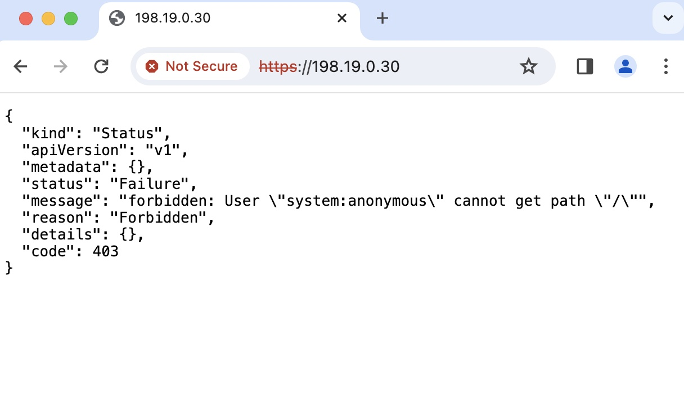

# Kubernetes Metric Server

*** **NEVER WORKED** ***

## Install
Get the `yaml` file with the command:
```sh
curl -LO https://github.com/kubernetes-sigs/metrics-server/releases/latest/download/high-availability-1.21+.yaml
```

Edit the file `high-availability-1.21+.yaml` and change the order for preferred address type to have `Hostname` at the begginning. The parameter is around (line 147) or use the command below:
```sh
sed -i 's/\(.*- --kubelet-preferred-address-types=\).*/\1Hostname,InternalDNS,InternalIP,ExternalDNS,ExternalIP/' high-availability-1.21+.yaml
```

Create the metric server with the command:
```sh
kubectl apply -f high-availability-1.21+.yaml
```

## Verification
If you used the H.A., you should see two Pods. At this point it's normal that the Pods are not in `Ready 1/1`:
```sh
kubectl get pods -n kube-system -l k8s-app=metrics-server
```

```
NAME                              READY   STATUS    RESTARTS   AGE
metrics-server-5d79fcb458-59vk5   0/1     Running   0          117s
metrics-server-5d79fcb458-lzsb4   0/1     Running   0          117s
```

# Troubleshoot

```sh
kubectl logs -n kube-system -l k8s-app=metrics-server --container metrics-server
```


## Error 1 (Already fixed)
```
E1228 20:18:00.194951       1 scraper.go:140] "Failed to scrape node" err="Get \"https://10.102.1.101:10250/metrics/resource\": x509: cannot validate certificate for 10.102.1.101 because it doesn't contain any IP SANs" node="k8s1worker1.kloud.lan"
```

Edit the file `high-availability-1.21+.yaml` and change the order for preferred address type to have `Hostname` at the begginning. The parameter is around (line 147).
```
- --kubelet-preferred-address-types=Hostname,InternalDNS,InternalIP,ExternalDNS,ExternalIP
```

```sh
kubectl apply -f high-availability-1.21+.yaml
```

## Error 2
To fix the error `x509: certificate signed by unknown authority` follow these steps. This will **fix** the error instead of patching the problem 😉

## Edit ConfigMap
```sh
kubectl edit configmap kubelet-config  -n kube-system
```
Append `serverTLSBootstrap: true` in the `kubelet:` section and save.

## On each node (master or worker)
Append `serverTLSBootstrap: true` at the bottom of the file `/var/lib/kubelet/config.yaml`.

```sh
cat <<EOF | sudo tee -a /var/lib/kubelet/config.yaml > /dev/null
serverTLSBootstrap: true
EOF
```

Restart `kubelet` and check the status:
```sh
sudo systemctl restart kubelet
sleep 3
sudo systemctl status kubelet
```

At this stage, you will have one Kubelet certificate requests per master/worker node that aren't approved. You can check with the command `kubectl -n kube-system get csr`. We need to approve kubelet certificate requests with the command:
```sh
for kubeletcsr in `kubectl -n kube-system get csr | grep kubernetes.io/kubelet-serving | awk '{ print $1 }'`; do kubectl certificate approve $kubeletcsr; done
```

## Verify

### Check the Pods ready state
You should see `1/1` for every Pods (I'm running in H.A. mode)
```sh
kubectl get pods -n kube-system -l k8s-app=metrics-server
```

Output
```
NAME                                            READY   STATUS    RESTARTS        AGE
metrics-server-59db464fbd-bd84p                 1/1     Running   0               15m
metrics-server-59db464fbd-fc844                 1/1     Running   0               15m
```

### Check the logs of every Pods
I used a loop since I'm running Kubernetes Metric Server in H.A. mode.
```sh
for pods in `kubectl get pods -n kube-system | grep metrics-server | awk '{ print $1 }'`; do kubectl logs -n kube-system $pods; done
```

### 
```sh
kubectl top pods --all-namespaces
kubectl top node
```

-----------------------
# Metric Server Service
In this lab, I'm using Cilium CNI with BGP to advertise `EXTERNAL-IP`. I will install a Kubernetes Load Balancer in front of the metric server. I will map an external IP to the service.

- Create a new service of type `LoadBalancer` with an `CiliumLoadBalancerIPPool`
- Modify the existing service of type `Cluster-IP` to a service of type `LoadBalancer`

`CiliumLoadBalancerIPPool` has the notion of IP Pools which the administrator can create to tell Cilium the IP range from which to allocate `EXTERNAL-IP` IPs from.

Below is a manifest to create an IP Pools with IPv4 only and a selector based on the NameSpace named `kube-system`. This is where the metric server web Pod is located:
```sh
cat <<EOF > metric-server-ippool.yaml
apiVersion: "cilium.io/v2alpha1"
kind: CiliumLoadBalancerIPPool
metadata:
  name: "metric-server-pool"
spec:
  cidrs:
  - cidr: "198.19.0.24/29"
  serviceSelector:
    matchLabels:
      io.kubernetes.service.namespace: kube-system
EOF
kubectl apply -f metric-server-ippool.yaml
```

```
ciliumloadbalancerippool.cilium.io/metric-server-pool created
```

After adding the pool to the cluster, it appears like so:
```sh
kubectl get ippools
```

Output:
```
NAME                 DISABLED   CONFLICTING   IPS AVAILABLE   AGE
metric-server-pool   false      False         6               17s
```

# Services
Any service with `.spec.type=LoadBalancer` can get IPs from any pool as long as the IP Pool's service selector matches the service. If you omit the key/value `type: LoadBalancer` when you create the K8s service, Cilium won't allocate the `EXTERNAL-IP`.

Modify the existing service and:
- change the type `ClusterIP` to type `LoadBalancer`
- add `allocateLoadBalancerNodePorts: false` under `spec:` (we don't need to allocate a NodePort)

You can use the command `kubectl edit services -n kube-system metrics-server` and modify the service with `vi` editor or just paste the following line and the services will be updated:
```sh
kubectl patch services -n kube-system metrics-server --type=json -p '[{"op":"replace","path":"/spec/type","value":"LoadBalancer"},{"op":"add","path":"/spec/allocateLoadBalancerNodePorts","value":false}]'
```

Output:
```
service/metrics-server patched
```

Verify that the service has an `EXTERNAL-IP` and that no `nodePort` have been assigned:
```sh
kubectl get services -n kube-system
kubectl get svc -n kube-system metrics-server -o jsonpath='{.status.loadBalancer.ingress[0].ip}{"\n"}'
```

Output:
```
NAME             TYPE           CLUSTER-IP     EXTERNAL-IP   PORT(S)                  AGE
metrics-server   LoadBalancer   198.18.1.39    198.19.0.30   443/TCP                  141m
```

The `EXTERNAL-IP` has been taken from the `metric-server-pool` with CIDR `198.19.0.24/29`.
```sh
kubectl get CiliumLoadBalancerIPPool metric-server-pool -o go-template='External CIDR: {{range .spec.cidrs}}{{.cidr}}{{"\n"}}{{- end -}}'
```

Output:
```
External CIDR: 198.19.0.24/29
```

# Verify
Open a browser and point it to https://198.19.0.30



#
## Generate the client CSR
Generate a private key and a CSR to be signed by Kubernetes. The CSR is basically a certificate not signed by any CA.
```sh
# Generate the private key
openssl ecparam -name prime256v1 -genkey -out user-key.pem
openssl genpkey -algorithm RSA -pkeyopt rsa_keygen_bits:2048 -out rsa-key.pem
# Generate the CSR
openssl req -new -sha256 -key rsa-key.pem -subj "/C=CA/ST=QC/L=Montreal/O=metric-server/OU=IT/CN=daniel" -out rsa-csr.pem
```

## Prepare the CSR
Create the `yaml` file:
```sh
cat <<EOF | kubectl create -f -
apiVersion: certificates.k8s.io/v1
kind: CertificateSigningRequest
metadata:
  name: user-csr
spec:
  groups:
  - system:authenticated
  request: $(cat rsa-csr.pem | base64 | tr -d '\n')
  signerName: kubernetes.io/kube-apiserver-client
  usages:
  - client auth
EOF
```

## Approve the CSR
Approve the Pending CSR. Kubernetes will signed it and generate the certificate:
```sh
kubectl get csr user-csr
kubectl certificate approve user-csr
```

## Retreive the signed certificate
Get the signed certificate:
```sh
kubectl get csr user-csr -o jsonpath='{.status.certificate}'| base64 -d > rsa-crt.pem
```

Get the Kubernetes CA certificate (the one that signed our client certificate we did above)
```sh
scp daniel@k8s1master1.kloud.lan:/etc/kubernetes/pki/ca.crt .
```

Verify the certification chain:
```sh
openssl verify -CAfile ca.crt rsa-crt.pem
```

Generate the full chain of trust with comments inside the PEM file. The file `fullchain.pem` contains the client certificate and the CA certificate:
```sh
CA_CERTS=( "rsa-crt.pem" "ca.crt" )
CA_CHAIN="fullchain.pem"
for CERT in "${CA_CERTS[@]}"
do
  openssl x509 -noout -subject -in ${CERT} | awk '{print "# "$0""}' >> "${CA_CHAIN}"
  openssl x509 -noout -issuer -in ${CERT} | awk '{print "# "$0""}' >> "${CA_CHAIN}"
  openssl x509 -noout -serial -in ${CERT} | awk '{print "# "$0""}' >> "${CA_CHAIN}"
  openssl x509 -noout -fingerprint -in ${CERT} | awk '{print "# "$0""}' >> "${CA_CHAIN}"
  openssl x509 -noout -dates -in ${CERT} | awk '{print "# "$0""}' >> "${CA_CHAIN}"
  openssl x509 -in ${CERT} >> "${CA_CHAIN}"
done
```

## Generate pkcs12
```sh
openssl pkcs12 -export -inkey rsa-key.pem -in rsa-crt.pem -certfile fullchain.pem -out rsa.p12 -passout pass:topsecret
```


# References
https://github.com/kubernetes-sigs/metrics-server
https://github.com/kubernetes-sigs/metrics-server/issues/196
