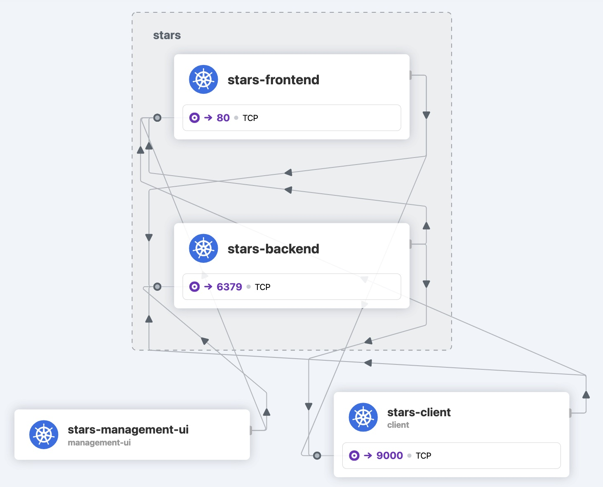

# Running the stars example
Create the frontend, backend, client, and management-ui apps.

```sh
kubectl create -f https://docs.tigera.io/files/00-namespace.yaml
kubectl create -f https://docs.tigera.io/files/01-management-ui.yaml
kubectl create -f https://docs.tigera.io/files/02-backend.yaml
kubectl create -f https://docs.tigera.io/files/03-frontend.yaml
kubectl create -f https://docs.tigera.io/files/04-client.yaml
```

Output:
```
namespace/stars created
namespace/management-ui created
service/management-ui created
deployment.apps/management-ui created
service/backend created
deployment.apps/backend created
service/frontend created
deployment.apps/frontend created
namespace/client created
deployment.apps/client created
service/client created
```

> [!NOTE]  
> Three namespace have been created: stars, management-ui and client

# Modify the existing service `ui`
Modify the existing service `management-ui`, of type `NodePort` to a service of type `LoadBalancer` and remove the `nodePort:30002`

```sh
kubectl get svc -n management-ui
NAME            TYPE       CLUSTER-IP     EXTERNAL-IP   PORT(S)          AGE
management-ui   NodePort   198.18.0.222   <none>        9001:30002/TCP   9m42s
```

## Create IP Pool
Below is a manifest to create an IP Pools with IPv4 only and a selector based on the NameSpace named `management-ui`. This is where the `management-ui` web Pod is located:
```sh
cat <<EOF | kubectl apply -f -
apiVersion: "cilium.io/v2alpha1"
kind: CiliumLoadBalancerIPPool
metadata:
  name: "management-ui-pool"
spec:
  cidrs:
  - cidr: "198.19.0.64/29"
  serviceSelector:
    matchLabels:
      io.kubernetes.service.namespace: management-ui
EOF
```

Output:
```
ciliumloadbalancerippool.cilium.io/management-ui-pool created
```

After adding the pool to the cluster, it appears like so:
```sh
kubectl get ippools
```

Output:
```
NAME                     DISABLED   CONFLICTING   IPS AVAILABLE   AGE
management-ui-pool       false      False         6               13s
```

## management-ui Service
I prefer to add an external IP address to the services that I need to access via a browser. This way I can use any PC outside the cluster. Let's convert the `management-ui` from a type `NodePort` to a type `LoadBalancer`. This is a two-step process:
- change `type: NodePort` to `type: ClusterIP`
- change `type: ClusterIP` to `type: LoadBalancer`
- add `allocateLoadBalancerNodePorts: false` under `type: LoadBalancer`

Patch the Kubernetes service `management-ui` with the commands:
```sh
# Change the service to 'ClusterIP' to remove 'NodePort'
kubectl patch services -n management-ui management-ui --type=json -p '[{"op":"replace","path":"/spec/type","value":"ClusterIP"}]'
# Change the service to 'LoadBalancer' without 'NodePort'
kubectl patch services -n management-ui management-ui --type=json -p '[{"op":"replace","path":"/spec/type","value":"LoadBalancer"},{"op":"add","path":"/spec/allocateLoadBalancerNodePorts","value":false}]'
```

```sh
kubectl get services -n management-ui
```

We know have an external IP, `198.19.0.70`, to access the service from outside the cluster:
```
NAME            TYPE           CLUSTER-IP     EXTERNAL-IP   PORT(S)    AGE
management-ui   LoadBalancer   198.18.0.222   198.19.0.70   9001/TCP   22m
```

Now visit http://198.19.0.70 or http://management-ui.management-ui.k8s1-prod.kloud.lan:9001. Voila! You should see a page with 


Each service is represented by a single node in the graph. By default, they should have full connectivity. 

- backend is represented by Node "B"
- frontend is represented by Node "F"
- client is represented by Node "C"

# 

Client:
```
Labels:           pod-template-hash=74f7fbc87c
                  role=client
```

Backend:
```
Labels:           pod-template-hash=b8cb45475
                  role=backend
```

```yaml
cat <<EOF | kubectl apply -f -
apiVersion: "cilium.io/v2"
kind: CiliumNetworkPolicy
metadata:
  name: "rule1"
  namespace: "client"
spec:
  description: "L3-L4 policy to restrict client access to backend"
  endpointSelector:
    matchLabels:
      role: backend
  ingress:
  - fromEndpoints:
    - matchLabels:
        org: client
    toPorts:
    - ports:
      - port: "6379"
        protocol: TCP
EOF
```

## Add labels (Optional)
I'm using Cilium CNI with Hubble. Hubble uses the label `app` for the name of the Pods. In the absence of that label, the name of the Pod is shown as `Unknown`. Let's add the label `app` for the Pods in the namespaces `client`, `stars` and `management-ui`.

```sh
kubectl label $(kubectl get pods -n client -o name) -n client app=stars-client
kubectl label $(kubectl get pods -n management-ui -o name) -n management-ui app=stars-management-ui
kubectl label $(kubectl get pods -n stars -l role=backend -o name) -n stars app=stars-backend
kubectl label $(kubectl get pods -n stars -l role=frontend -o name) -n stars app=stars-frontend
```

You're output should look like this:
```
pod/client-74f7fbc87c-zc8rw labeled
pod/management-ui-7496b7865-c4vt9 labeled
pod/backend-b8cb45475-2zq62 labeled
pod/frontend-bd7c7d98c-xrtfq labeled
```



# Cleanup
You just need to delete the three namespace and the IP Pool for the cleanup.
```sh
kubectl delete ns client stars management-ui
```

Delete the Cilium IPPool with the command:
```sh
cat <<EOF | kubectl delete -f -
apiVersion: "cilium.io/v2alpha1"
kind: CiliumLoadBalancerIPPool
metadata:
  name: "management-ui-pool"
spec:
  cidrs:
  - cidr: "198.19.0.64/29"
  serviceSelector:
    matchLabels:
      io.kubernetes.service.namespace: management-ui
EOF
```

# References
[Tigera Stars Demo](https://docs.tigera.io/calico/latest/network-policy/get-started/kubernetes-policy/kubernetes-demo)  
[Cilium Network Policy](https://docs.cilium.io/en/stable/gettingstarted/demo/)  
