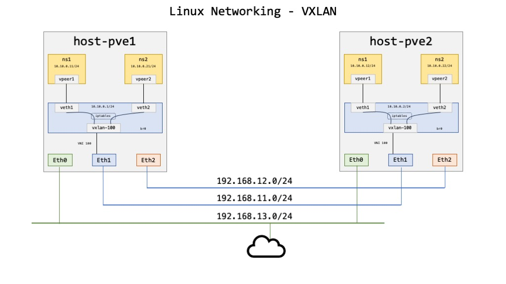

# Ubuntu 22.04.3 LTS
This is a template of a basic Ubuntu 22.04.3 LTS server. The size on disk of the `qcow2` image is less than 4Gb. The images reside in the directories:
- `/var/lib/libvirt/images/k8s1ubuntu1/` for node `pve1.kloud.lan`
- `/var/lib/libvirt/images/k8s1ubuntu2/` for node `pve2.kloud.lan`

|Filename|FQDN|IP|OS|Kernel|RAM|vCPU|Node|
|----|----|----|----|----|----|----|----|
|k8s1ubuntu1.qcow2|k8s1ubuntu1.kloud.lan|10.100.1.51|Ubuntu 22.04.3|6.7.1|4G|2|pve1.kloud.lan|
|k8s1ubuntu2.qcow2|k8s1ubuntu2.kloud.lan|10.100.1.52|Ubuntu 22.04.3|6.7.1|4G|2|pve2.kloud.lan|

I will demonstrate how to *clone* a new VM from an existing image.

## Things to know
I don't line `nano`, so I added the `EDITOR` env variable and set it to `vi`.
```sh
EDITOR=vi virsh edit k8s1ubuntu1
sudo EDITOR=vi virsh edit k8s1ubuntu1
```

## Stop the VM
Make sure the VM is stopped with the command:
```sh
virsh list | grep k8s1ubuntu1
```

If it's running, you will see an output like this one:
```
 18   k8s1ubuntu1    running
```

# Node PVE1
> [!IMPORTANT]  
> This section applies to node `pve1`.

I have two nodes that I interconnectd via some physical Ethernet interfaces. I have a VxLAN configured for every network that gives me the choice of running VMs on any nodes and they are connected. I'm extending the bridge between the nodes.



## Define Variables
Define all the variables needed for the scripts below. Make sure you execute the scripts in the same window as the one you defined the variables.
```sh
# VM template. This is an existing VM and it must be shutdown
ORIGINAL="k8s1ubuntu1"
ORIGINAL_IP="10.100.1.51"   # IP address of the VM template
ORIGINAL_GTW="10.100.1.1"   # Default gateway of the VM template

# Declare a "kindOf" dictionnary of the new VM(s). Add as many as you need.
# Make sure they have different names and IP address.
declare -A newVM
newVM[ubuntu11]="10.100.1.71"
newVM[ubuntu12]="10.100.1.72"

# Subnet info for the VMs
localSubnet="10.100.1.0"
subnetMask="24"
defaultGateway="10.100.1.1"
localBroadcast="10.100.1.255"

# The switch
BRIDGE="br_bastion_1"

# VxLAN variables. You can find those values with the cmd: "ip link show | grep bastion"
VXLAN_ID="10100"
VXLAN_NAME="bastion-10100"
VTEP1_ADDR="192.168.11.1"
VTEP2_ADDR="192.168.11.2"
VTEP_DEV="eth1"
```

## Creating a new virtual network
This assumes that a Linux bridge with an IP address that will be the default gateway already exists.

### Clone VM
Start by cloning a valid VM. Make sure the template VM is shutdown:
```sh
virsh shutdown ${ORIGINAL}
for NEW in "${!newVM[@]}"
do
  # Create the new directory
  sudo install -v -d -g libvirt -o libvirt-qemu /var/lib/libvirt/images/${NEW}

  # Clone the VM
  sudo virt-clone --connect qemu:///system \
  --original ${ORIGINAL} --name ${NEW} \
  --file /var/lib/libvirt/images/${NEW}/${NEW}.qcow2

  # Change permission
  sudo chown libvirt-qemu:libvirt /var/lib/libvirt/images/${NEW}/${NEW}.qcow2
done
```

> [!NOTE]  
> You should get this error for the above script. This is normal 😉. I'm making sure the sourve VM is shutdown.
```
error: Failed to shutdown domain 'k8s1ubuntu1'
error: Requested operation is not valid: domain is not running
```

### Customize the VMs
Once you have cloned the VM, you can customize the new virtual machines with `virt-sysprep` utility. Make sure the utility is installed on your host with the command `sudo apt install guestfs-tools`
```sh
OPERATIONS=$(virt-sysprep --list-operations | egrep -v 'lvm-uuids|fs-uuids|ssh-hostkeys|ssh-userdir' | awk '{ printf "%s,", $1}' | sed 's/,$//')

for NEW in "${!newVM[@]}"
do
  sudo virt-sysprep -d ${NEW} \
  --hostname ${NEW}.kloud.lan \
  --enable ${OPERATIONS} \
  --keep-user-accounts daniel \
  --run-command "sed -i \"s/127.0.1.1.*/127.0.1.1 ${NEW}/\" /etc/hosts" \
  --run-command "sed -i \"s/127.0.0.1 localhost/127.0.0.1 localhost ${NEW}/\" /etc/hosts" \
  --run-command "sed -i \"s/${ORIGINAL_IP}/${newVM[${NEW}]}/\" /etc/netplan/50-cloud-init.yaml" \
  --run-command "sed -i \"s/${ORIGINAL_GTW}/${defaultGateway}/\" /etc/netplan/50-cloud-init.yaml"
done
```

> [!NOTE]  
> The ip addresses on the left side of the `sed` command are the ip's of the original template. The `sed` command just replaces the old ip with the new ones.

### Attach VM to bridge
> [!NOTE]  
> You can skip this section if your VM template has the correct bridge network configured.

Attach the VM to the bridge network:
```sh
cat <<EOF >net.xml
<interface type='bridge'>
  <source bridge="${BRIDGE}"/>
  <model type='virtio'/>
  <address type='pci' domain='0x0000' bus='0x01' slot='0x00' function='0x0' multifunction='on'/>
</interface>
EOF

for NEW in "${!newVM[@]}"
do
  virsh update-device ${NEW} net.xml
done

rm -f net.xml
```

## Start the VMs
Start the VMs.

> [!NOTE]  
> By default the VMs won't auto start. I added the line `virsh autostart ${NEW}` for them to start automaticaly.

```sh
#!/bin/bash
for NEW in "${!newVM[@]}"
do
  printf "Starting VM %s\n" "${NEW}"
  virsh start ${NEW}
  # virsh autostart ${NEW}
done
```

> [!NOTE]  
> In case you didn't want `autostart`, you can type the command: `virsh autostart --disable ${NEW}`

## Add SNAT (Optional)
You can add a source NAT rule for the VMs to access the Internet via the node's default gateway. This command configure the NAT.

IF THE FILE `/etc/iptables/rules.v4` EXISTS use this command:
```sh
sudo sed -i -e '/# Forward traffic.*/a\' -e "-A POSTROUTING -s ${localSubnet}/${subnetMask} -o eth0 -j MASQUERADE" /etc/iptables/rules.v4
```

If the file `/etc/iptables/rules.v4` doesn't exist, use the following:
```sh
cat <<EOF | sudo tee -a /etc/iptables/rules.v4
# nat Table rules
*nat
:POSTROUTING ACCEPT [0:0]

# Forward traffic from VM subnets through eth0.
-A POSTROUTING -s ${localSubnet}/${subnetMask} -o eth0 -j MASQUERADE

# don't delete the 'COMMIT' line or these nat table rules won't be processed
COMMIT
EOF
```

You can apply the rules with the command:
```sh
sudo iptables-restore /etc/iptables/rules.v4
```

## COPY THE IMAGE TO ANOTHER SERVER --- PLEASE MOVE ME SOMEWHERE ELSE !!!
Copy the `qcow2` image from one server to the other and set the correct ownership:
```sh
sudo rsync -r -v --rsync-path="sudo rsync" /var/lib/libvirt/images/k8s1ubuntu1 daniel@pve2:/var/lib/libvirt/images
ssh pve2 sudo chown -r libvirt-qemu:libvirt /var/lib/libvirt/images/k8s1ubuntu1
```

> [!IMPORTANT]  
> Make sure the VM is stopped before copying.

---

# Node PVE2
> [!IMPORTANT]  
> This section applies to node `pve2`.

## Define Variables
Define all the variables needed for the scripts below. Make sure you execute the scripts in the same window as the one you defined the variables.
```sh
# VM template. This VM must be shutdown
ORIGINAL="k8s1ubuntu2"
ORIGINAL_IP="10.100.1.52"   # IP address of the VM template
ORIGINAL_GTW="10.100.1.1"   # Default gateway of the VM template

# Declare a "kindOf" dictionnary of the new VM(s)
declare -A newVM
newVM[ubuntu21]="10.100.1.81"
newVM[ubuntu22]="10.100.1.82"

# Subnet info for the VMs
localSubnet="10.100.1.0"
subnetMask="24"
defaultGateway="10.100.1.2"
localBroadcast="10.100.1.255"

# The switch
BRIDGE="br_bastion_1"

# VxLAN variables. You can find those values with the cmd: "ip link show | grep bastion"
VXLAN_ID="10100"
VXLAN_NAME="bastion-10100"
VTEP1_ADDR="192.168.11.2"
VTEP2_ADDR="192.168.11.1"
VTEP_DEV="eth1"
```

## Creating a new virtual network
This assumes that a Linux bridge with an IP address that will be the default gateway already exists.

### Clone VM
Start by cloning a valid VM. Make sure the template VM is shutdown:
```sh
virsh shutdown ${ORIGINAL}
for NEW in "${!newVM[@]}"
do
  # Create the new directory
  sudo install -v -d -g libvirt -o libvirt-qemu /var/lib/libvirt/images/${NEW}

  # Clone the VM
  sudo virt-clone --connect qemu:///system \
  --original ${ORIGINAL} --name ${NEW} \
  --file /var/lib/libvirt/images/${NEW}/${NEW}.qcow2

  # Change permission
  sudo chown libvirt-qemu:libvirt /var/lib/libvirt/images/${NEW}/${NEW}.qcow2
done
```

> [!NOTE]  
> You should get this error for the above script. This is normal 😉. I'm making sure the sourve VM is shutdown.
```
error: Failed to shutdown domain 'k8s1ubuntu2'
error: Requested operation is not valid: domain is not running
```

### Customize the VMs
Once you have cloned the VM, you can customize the new virtual machines with `virt-sysprep` utility. Make sure the utility is installed on your host with the command `sudo apt install guestfs-tools`
```sh
OPERATIONS=$(virt-sysprep --list-operations | egrep -v 'lvm-uuids|fs-uuids|ssh-hostkeys|ssh-userdir' | awk '{ printf "%s,", $1}' | sed 's/,$//')

for NEW in "${!newVM[@]}"
do
  sudo virt-sysprep -d ${NEW} \
  --hostname ${NEW}.kloud.lan \
  --enable ${OPERATIONS} \
  --keep-user-accounts daniel \
  --run-command "sed -i \"s/127.0.1.1.*/127.0.1.1 ${NEW}/\" /etc/hosts" \
  --run-command "sed -i \"s/127.0.0.1 localhost/127.0.0.1 localhost ${NEW}/\" /etc/hosts" \
  --run-command "sed -i \"s/${ORIGINAL_IP}/${newVM[${NEW}]}/\" /etc/netplan/50-cloud-init.yaml" \
  --run-command "sed -i \"s/${ORIGINAL_GTW}/${defaultGateway}/\" /etc/netplan/50-cloud-init.yaml"
done
```

> [!NOTE]  
> The ip addresses on the left side of the `sed` command are the ip's of the original template. The `sed` command just replaces the old ip with the new ones.

### Attach VM to bridge
> [!NOTE]  
> You can skip this section if your VM template has the correct bridge network configured.

Attach the VM to the bridge network:
```sh
cat <<EOF >net.xml
<interface type='bridge'>
  <source bridge="${BRIDGE}"/>
  <model type='virtio'/>
  <address type='pci' domain='0x0000' bus='0x01' slot='0x00' function='0x0' multifunction='on'/>
</interface>
EOF

for NEW in "${!newVM[@]}"
do
  virsh update-device ${NEW} net.xml
done

rm -f net.xml
```

## Start the VMs
Start the VMs.

> [!NOTE]  
> By default the VMs won't auto start. I added the line `virsh autostart ${NEW}` for them to start automaticaly.

```sh
#!/bin/bash
for NEW in "${!newVM[@]}"
do
  printf "Starting VM %s\n" "${NEW}"
  virsh start ${NEW}
  # virsh autostart ${NEW}
done
```

## Add SNAT (Optional)
You can add a source NAT rule for the VMs to access the Internet via the node's default gateway. This command configure the NAT.

IF THE FILE `/etc/iptables/rules.v4` EXISTS use this command:
```sh
sudo sed -i -e '/# Forward traffic.*/a\' -e "-A POSTROUTING -s ${localSubnet}/${subnetMask} -o eth0 -j MASQUERADE" /etc/iptables/rules.v4
```

If the file `/etc/iptables/rules.v4` doesn't exist, use the following:
```sh
cat <<EOF | sudo tee -a /etc/iptables/rules.v4
# nat Table rules
*nat
:POSTROUTING ACCEPT [0:0]

# Forward traffic from VM subnets through eth0.
-A POSTROUTING -s ${localSubnet}/${subnetMask} -o eth0 -j MASQUERADE

# don't delete the 'COMMIT' line or these nat table rules won't be processed
COMMIT
EOF
```

You can apply the rules with the command:
```sh
sudo iptables-restore /etc/iptables/rules.v4
```

# Cleanup
This has to be done on every node, in my case `pve1.kloud.lan` and `pve2.kloud.lan`.

## Destroy the VMs (Optional)
If you want to completely destroy the VMs and remove the disk image, use the script below:
```sh
for VM in "${!newVM[@]}"
do
  virsh shutdown ${VM}
  STATUS=$(virsh domstate ${VM})
  while ([ "${STATUS}" != "shut off" ] )
  do
    STATUS=$(virsh domstate ${VM})
    printf "   Status of VM [%s] is: %s\n" "${VM}" "${STATUS}"
    sleep 2
  done
  printf "[%s] is shutdown: %s\n" "${VM}" "${STATUS}"
  sudo virsh undefine ${VM} --remove-all-storage --wipe-storage
  virsh pool-destroy ${VM}
  # Directory is not removed???
  # sudo rm -rf /var/lib/libvirt/images/${VM}
done
```

## Environment variables
Cleanup the environment variables with the commands below:
```sh
unset ORIGINAL
unset ORIGINAL_IP
unset ORIGINAL_GTW
unset newVM
unset localSubnet
unset subnetMask
unset defaultGateway
unset localBroadcast
unset BRIDGE
unset VXLAN_ID
unset VXLAN_NAME
unset VTEP1_ADDR
unset VTEP2_ADDR
unset VTEP_DEV
```

# Troubleshoot
Show bridge details:
```sh
ip -d link show br_etcd_1
```

Show port in bridge:
```sh
sudo brctl show br_etcd_1
```

```sh
ip -brief link
```

# BUGS
If you get this message `Cannot call Open vSwitch: ovsdb-server.service is not running.` after `sudo netplan apply` then apply this patch on the file `/usr/share/netplan/netplan/cli/commands/apply.py`

The patch just checks if **Open vSwitch** is active.
```
             if exit_on_error:
                 sys.exit(1)
         except OvsDbServerNotRunning as e:
- logging.warning('Cannot call Open vSwitch: {}.'.format(e))
+ if utils.systemctl_is_active('ovsdb-server.service'):
+   logging.warning('Cannot call Open vSwitch: {}.'.format(e))
```